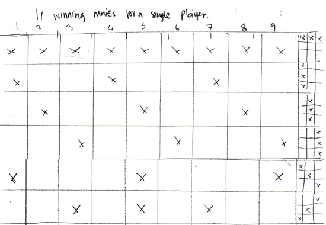

#Tic Tac Toe game - Adam Lemmo - 2017-02-23

Description of the files included

| File name and path       | Description           | 
|:------------- |:-------------| 
|[game.htm](game.htm) | The HMTL file that contains most of the content of the game.|
|[css/game.css](css/game.css) | All css styles are contained within this file. |
|[js/jquery.js](js/jquery.js) | The javascript library that game.js refers to. |
|[js/game.js](js/game.js) | The main javascript file, contains most of the code for the functionality of the game.|

##Function breakdown ([js/game.js](js/game.js))

| Function       | Description           | 
|:------------- |:-------------| 
|`startGame()` | This function as it states, starts the game, it is triggered from the `startBtn` link. |
|`selectPanel()` | This function is triggered from the panels in the layout of the game, it is a central function to the game, and represents the users actions in the game.|
|`computerMove()` | This function represents the actions of the computer, and it follows the order of the `aiOrder[]` array.|
|`checkCombination()` | This function is the most generic function in the code, but also the most complex, it check the users and the computers progress in the game, and compares it to the list of valid combinations in the game rules.  This function also determines the completion of the game, whether it’s the use or the computer that wins, or if a draw, or ‘tie’ is encountered.|

##jQuery
The game makes use of the jQuery Javascript library. I would have been able to produce this without jQuery, however it would have resulted in much more code, and it also afforded me the opportunity to add minor flourishes to the appearance of several game elements in the form of fades etc. jQuery also makes the code more succinct and readable, and removes the need for constant execution of DOM functions for simple element retrieval.
 
##The approach / problem solving (my thinking)
Initially I started out with the layout of the markup. As I was later to discover, some examples of the game on the web, used a table to layout the ‘panels’ (as I called them) of the game. I found this unnecessary and even problematic to the games logic. I instead chose a linear sequence of divs, floated left within a fixed width container to simulate the appearance of a game grid. This then enabled me to conceptualize the game in a linear way. I set about working out the games rules by mapping the winning ‘moves ‘onto this linear sequence of panels.



This was then uses as a basis for the game rules I created in the game, in the form of several arrays of numbers that the games code would reference to determine correctness from either player.

_Code example 1:- The arrays storing the games rules._

```javascript
row1 = [1, 2, 3];
row2 = [4, 5, 6];
row3 = [7, 8, 9];
col1 = [1, 4, 7];
col2 = [2, 5, 8];
col3 = [3, 6, 9];
diag1 = [1, 5, 9];
diag2 = [3, 5, 7];
```

#My WCAG and Usability approach
I took the following steps to ensure a moderate level of WCAG/Usability compliance.
*	I ensured that the colours I chose for the layout were of sufficient contrast.
*	The size of fonts in the game we taken into consideration, large and clear.
*	Text was used instead of graphics for the “X” and “O” characters of the game.
*	Hyperlinks were used where appropriate, so that native keyboard access of selectable areas is possible.
*	Radio/Form controls was used for optional character selection.

#References
I did not use any code from any of the following links, I merely used them as inspiration for my own development.
http://www.javascriptkit.com/script/script2/tactoe.shtml - This page gave me insight into the rules of the computer player/AI, I was a bit disappointed with the repetitious code however, so I made my logic loop through the rules instead.
http://stackoverflow.com/questions/1282528/compare-array-in-javascript
http://stackoverflow.com/questions/6229197/how-to-know-if-two-arrays-have-the-same-values
http://vikasrao.wordpress.com/tag/javascript-array-comparison/
 - I consulted many pages like these on stackoverflow (and other sites) for assistance in array comparison functions, which I never used, but nevertheless I consulted these resources during the development of the game. I found that I either didn’t need to use this functionality, or that it didn’t directly assist me with the issues I was facing.

#Interface and design for the target audience
I chose a relatively simple interface, with a straightforward left to right layout, to leverage intuitive ideas that hopefully the user would appreciate, however without user testing, this is largely unknown. I deliberately stayed away from a modal dialog for feedback, as my experience has told me that it’s best not to obscure content from the user, and in the case of this game, when feedback appears, it was hiding the outcome of the game, which is both bad if the user wins or loses. Buttons were styled the same, as to assist the user in identifying them as elements to select.

#Improvements/Opportunities
1. The AI of the game is reasonably easy to defeat, as it’s merely a sequence of steps that the “computer” player undertakes. I started but did not complete, work on a more intelligent AI, that would actively block the users attempts to get a winning sequence, this proved difficult due to time constraints and other factors.
2. The graphic design, while simple and clean, could stand to have more time spent on it, I thought it might be a cute idea to assign avatars/icons to the “characters” turning them into colourful identities of their own, which could potentially alter the feel of the game entirely, and turn it into a new experience.

#Comments to document code
The code in [js/game.js](js/game.js) is well documented in the form of comments almost line-by-line in the code. I find this to help my own development after I finish a major piece of code, as it helps me to consolidate the thought processes I undertook while programming, and also to help me to understand the flow of the program long after I have completed the project, and moved on. This in turn would assist another person to read the code I have produced. If another developer were to approach this code, I would recommend starting at the top of the [js/game.js](js/game.js) file and following the running commentary of the documented comments.
